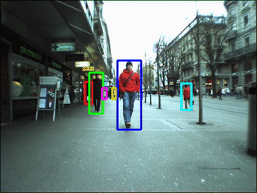

object-tracker
---
[](https://travis-ci.org/4d55397500/object-tracker)



An intelligence system for tracking based on data from the [Muliple Object Tracking Benchmark](https://motchallenge.net/).

System consists of a `loader`, `trainer`, and `indexer`.


**sources** holds mp4 files. There are 3 sorts of sources:

 * *.mp4: *raw video*
 * *-det.mp4: *identified but not classified objects/people*
 * *-gt.mp4: *identified and classified objects/people*


**cache** holds compressed numpy array representations of frame sequences


**labels** holds frame sequence labels, including bounding boxes


### Download sources

Download mp4 video files from the [Muliple Object Tracking Benchmark](https://motchallenge.net/).

```
$ ./download_sources
```
### Train

```
$ python objtracker/trainer.py
```

### Describe

A script is provided to give a text description of the sequence of tracked objects or people coming in or out of the scene.

```
$ python objtracker/describe.py objtracker/labels/*-gt.txt

----- Frame 1 -----
Number of objects: 6
New object 1 appeared in this frame
New object 3 appeared in this frame
New object 2 appeared in this frame
New object 5 appeared in this frame
New object 4 appeared in this frame
New object 6 appeared in this frame
----- Frame 2 -----
Number of objects: 6
----- Frame 3 -----
Number of objects: 6
----- Frame 4 -----
Number of objects: 6
New object 7 appeared in this frame
Object 1 disappeared from this frame
....
```

### Use with pretrained models

Pretrained detection of objects, with scores, category identification, and bounding boxes is implemented for cached numpy arrays of frames [here](objtracker/pretrained.py), using a pretrained model in the [Tensorflow object detection model zoo](https://github.com/tensorflow/models/blob/master/research/object_detection/g3doc/detection_model_zoo.md).

```
Running detection ...
300 objects detected
Detected bus at [ 0.38834649  0.46355954  0.61770302  0.54470783] with confidence 0.998029649258
Detected car at [ 0.55729872  0.58232194  0.65886098  0.64446479] with confidence 0.986325442791
Detected car at [ 0.74271494  0.          1.          0.20151579] with confidence 0.976649999619
Detected car at [ 0.49773172  0.55526364  0.56158018  0.59371865] with confidence 0.950774371624
Detected person at [ 0.53090078  0.69723791  0.67113394  0.73002726] with confidence 0.929940283298
Detected traffic light at [ 0.39916718  0.75449526  0.4722515   0.7770741 ] with confidence 0.915378570557

```